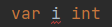
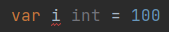
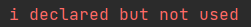

變數 Variable
===

# 變數基礎
* 由字母、數字、下劃線組成
    * 首個字符不能是數字
* 變數若定義了，不管有沒有賦值，**只要沒被使用，就會編譯錯誤**
  * 
  * 
  * 
  
# 變數宣告
## A. 標準宣告形式 : 
### 01. 指定變數型態，宣告但不賦值 : 
* 格式 : var 變數名稱 變數型態
  * 如 `var a int`
### 02. 指定變數型態，宣告且同時賦值 : 
* 格式 : var 變數名稱 變數型態 = 變數值
  * 如 `var a int = 10`
### 03. 不指定變數型態，由編譯器判斷的宣告 : 
* 格式 : var 變數名稱 = 變數值
  * 如 `var a = 10`
### 04. 批量宣告未初始化其值的變數 :
* 例子 : 
```go=
var (
    a int
    b string
)
```
## B. 簡短聲明格式 (短變量聲明格式) : 
變數型態會由編譯器自動推斷
### 01. 利用 `:=` 賦值操作符來宣告
* 格式 : 變數名稱 := 變數值
  * 例子 : `a := 10`
### 02. 多重簡短聲明與賦值 : 
* 例子 : `a,b := 10,20`
  
## C. 變數值未初始化的預設值 : 
* 整數(int)與浮點數(float) : 預設為 0 
* 字符串(string) : 預設為空字串 ' '
* 布林變數(bool) : 預設為 false
* 函數、指標、切片 : 預設為 nil 

## D. 變數宣告注意事項 : 
* 若重複定義變數，會報錯 : 
```go=
// 錯誤 01
var a = 10
var a = 20

// 錯誤 02
var a = 10
a := 20
```